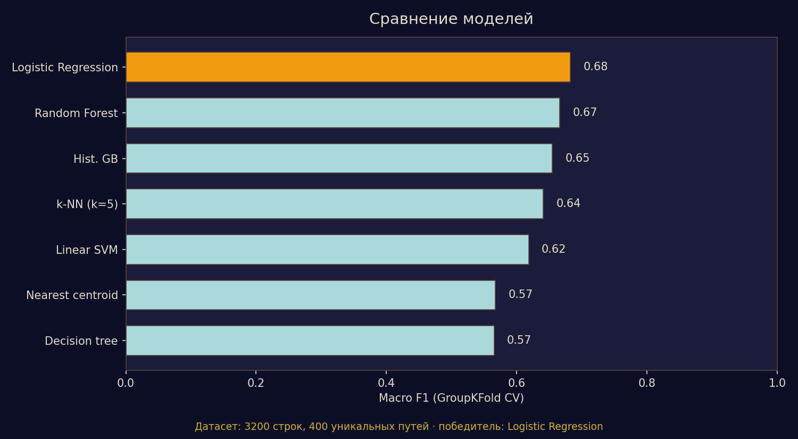
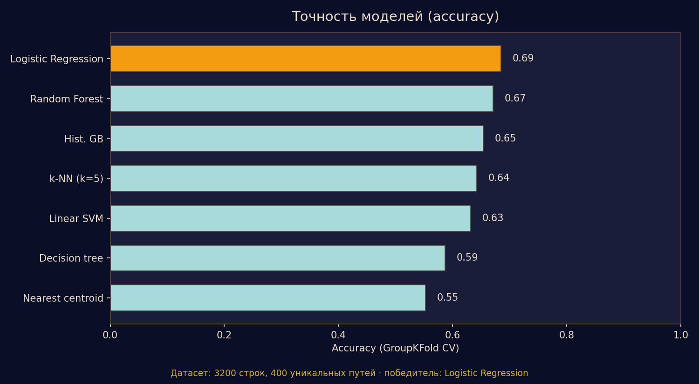

<!-- EN -->
# English (EN)

<div align="center">
  
  <h1>SagaOfTheAylopors_ML 📊🤖👽🐍</h1>
  <p>Machine Learning pipeline and model export system for real-time personality accentuation inference in Android visual novel game:  "Saga of the Aylopors" (https://github.com/SaruBeatz/SagaOfTheAylopors).</p>

  

  <p>
    <a href="https://www.python.org/"></a>
    <a href="https://scikit-learn.org/"></a>
    <a href="LICENSE"></a>
  </p>
</div>

---

## Executive Summary & Winning Model

This repository serves as the core Machine Learning submodule for **Saga of the Aylopors** (a mobile text-based RPG written in Java 17). During gameplay, the client tracks player decisions across a 10-dimensional behavioral feature vector (values bounded between `0.0` and `1.0`, starting at `0.5`). 

At chapter milestones or the game finale, the engine predicts the player's dominant psychological accentuation based on Karl Leonhard's personality typology (e.g., *Hyperthymic*, *Anxious*, *Emotive*, *Pedantic*, *Demonstrative*).

### Winner Model Profile (v1 Phase)
- **Selected Architecture**: Logistic Regression (LR)
- **Validation Metric**: **~0.68 macro-F1 score** under `GroupKFold` cross-validation (grouped by `path_id`).
- **Rationale**: Provides optimal classification balance and noise resilience while allowing zero-dependency math export (`weights`, `intercepts`, `scaler statistics`) directly into native Java/Kotlin Android code via JSON.

---

## Performance Benchmark

<table width="100%">
  <tr>
    <th width="50%" align="center">Macro-F1 Model Comparison</th>
    <th width="50%" align="center">Accuracy Model Comparison</th>
  </tr>
  <tr>
    <td align="center" valign="top">
      
      <p><sub>Cross-validation Macro-F1 performance comparison across model suite.</sub></p>
    </td>
    <td align="center" valign="top">
      
      <p><sub>Overall classification accuracy evaluation across algorithms.</sub></p>
    </td>
  </tr>
</table>

---

## Tech Stack & Submodule Architecture

<table>
  <tr>
    <td width="20%"><b>Core Utilities</b></td>
    <td>
      <code>common.py</code> &bull; Feature definitions, target profile constants, and 10D vector manipulation helpers.
    </td>
  </tr>
  <tr>
    <td width="20%"><b>Story Graph Simulation</b></td>
    <td>
      <code>story_graph.py</code> &bull; Parses chapter JSON files (<code>chapter_*.json</code>) and simulates greedy player decision paths.
    </td>
  </tr>
  <tr>
    <td width="20%"><b>Dataset Synthesis</b></td>
    <td>
      <code>generate_synthetic.py</code> &bull; Simulates automated playthrough trajectories with noise injection, baselines, and mixed archetypes into <code>data/synthetic.csv</code>.
    </td>
  </tr>
  <tr>
    <td width="20%"><b>Training & Evaluation</b></td>
    <td>
      <code>train_compare.py</code> &bull; Trains and benchmarks Classifiers (Centroid, kNN, LR, SVM, Random Forest, HistGradientBoosting, Decision Trees) via GroupKFold CV.
    </td>
  </tr>
  <tr>
    <td width="20%"><b>Sanity Validation</b></td>
    <td>
      <code>evaluate_profiles.py</code> &bull; Strict validation engine verifying 100% (10/10) recognition against benchmark logs (<code>profile_*_playthrough.txt</code>).
    </td>
  </tr>
  <tr>
    <td width="20%"><b>Model Export</b></td>
    <td>
      <code>export_model.py</code> &bull; Extracts raw weights and scaling matrices to <code>models/accentuation_export.json</code> and standalone <code>models/accentuation_export.py</code>.
    </td>
  </tr>
</table>

---

## Game-to-ML Attribute Mapping

To maintain parity between the Android Java client runtime and the Python training pipeline, game state parameters are mapped as follows:

| Game / Firestore Parameter | ML Feature Identifier | Scale Range |
| :--- | :--- | :--- |
| `sociality` | `Soc` | 0.0 – 1.0 (Default: 0.5) |
| `activity` | `Act` | 0.0 – 1.0 (Default: 0.5) |
| `emotionalSensitivity` | `Emp` | 0.0 – 1.0 (Default: 0.5) |
| `anxiety` | `Anx` | 0.0 – 1.0 (Default: 0.5) |
| `selfControl` | `Ctrl` | 0.0 – 1.0 (Default: 0.5) |
| `impulsivity` | `Imp` | 0.0 – 1.0 (Default: 0.5) |
| `egoFocus` | `Ego` | 0.0 – 1.0 (Default: 0.5) |
| `rigidity` | `Rig` | 0.0 – 1.0 (Default: 0.5) |
| `negativeAffect` | `Neg` | 0.0 – 1.0 (Default: 0.5) |
| `adaptability` | `Adp` | 0.0 – 1.0 (Default: 0.5) |

---

## Execution Step-by-Step Flow

### 1. Setup Environment
```bash
git clone https://github.com/SaruBeatz/SagaOfTheAylopors_ML.git
cd SagaOfTheAylopors_ML
pip install -r requirements.txt
```

### 2. Run Complete ML Pipeline
```bash
# Step 1: Synthesize playthrough data from chapter configs
python generate_synthetic.py

# Step 2: Train all models and export metrics
python train_compare.py

# Step 3: Run strict sanity verification on reference profiles
python evaluate_profiles.py
```

### 3. Model Testing & Verification
Verify build sanity using reference logs:
```bash
python evaluate_profiles.py
```

Inspect prediction on raw JSON vector:
```bash
python predict.py --json "{\"Soc\":0.36,\"Act\":0.22,\"Emp\":0.49,\"Anx\":1.0,\"Ctrl\":1.0,\"Imp\":0.31,\"Ego\":0.88,\"Rig\":0.75,\"Neg\":0.82,\"Adp\":0.58}"
```

Test against specific playthrough file:
```bash
python predict.py --profile ml/profile_Anxious_playthrough.txt
```

Index lookup in synthetic dataset:
```bash
python predict.py --csv-row data/synthetic.csv --index 100
```

### 4. Android Client Integration

1. Export lightweight model attributes:
   ```bash
   python export_model.py
   ```
2. Copy `models/accentuation_export.json` to the Android asset repository:
   `app/src/main/assets/ml/accentuation_export.json`
3. Execute client-side inference natively using `AccentuationPredictor.java` (computes matrix dot products without ML framework overhead).
4. For batch re-indexing Firestore records, utilize the backfill script:
   ```bash
   python scripts/firestore_backfill_predictions.py
   ```

---

---

<!-- RU -->
# Русский (RU)

<div align="center">
  
   <h1>SagaOfTheAylopors_ML 📊🤖👽🐍</h1>
  <p>Пайплайн машинного обучения и система экспорта моделей для классификации акцентуаций личности в Android-игре «Сага Айлопороса» (https://github.com/SaruBeatz/SagaOfTheAylopors).</p>

  <p>
    <a href="https://www.python.org/"></a>
    <a href="https://scikit-learn.org/"></a>
    <a href="LICENSE"></a>
  </p>
</div>

---

## Обзор проекта и лучшая модель

Данный репозиторий является ML-субмодулем для игры **«Сага Айлопороса»** (мобильная текстовая RPG на Java 17). В процессе прохождения клиент фиксирует решения игрока в виде 10-мерного вектора поведенческих параметров (значения от `0.0` до `1.0`, начальное значение `0.5`).

В конце глав или в финале игры алгоритм анализирует полученный вектор и определяет доминирующую психологическую акцентуацию по типологии Карла Леонгарда (например: *Гипертимная*, *Тревожная*, *Эмотивная*, *Педантичная*, *Демонстративная* и др.).

### Характеристики финальной модели (Фаза v1)
- **Выбранная архитектура**: Логистическая регрессия (Logistic Regression)
- **Точность классификации**: **~0.68 macro-F1 score** на кросс-валидации `GroupKFold` (с группировкой по `path_id`).
- **Причина выбора**: Идеальный баланс точности и устойчивости к шуму с возможностью автономного экспорта математических параметров (`weights`, `intercepts`, `scaler statistics`) в нативный Java/Kotlin код через компактный JSON.

---

## Результаты Бенчмарков

<table width="100%">
  <tr>
    <th width="50%" align="center">Сравнение моделей (Macro-F1)</th>
    <th width="50%" align="center">Сравнение моделей (Accuracy)</th>
  </tr>
  <tr>
    <td align="center" valign="top">
      
      <p><sub>Сравнение качества классификации моделей по метрике Macro-F1.</sub></p>
    </td>
    <td align="center" valign="top">
      
      <p><sub>Сравнительная общая точность алгоритмов классификации.</sub></p>
    </td>
  </tr>
</table>

---

## Технологический стек и архитектура

<table>
  <tr>
    <td width="20%"><b>Базовый модуль</b></td>
    <td>
      <code>common.py</code> &bull; Константы признаков, целевые профили и утилиты работы с 10D векторами.
    </td>
  </tr>
  <tr>
    <td width="20%"><b>Симуляция графа</b></td>
    <td>
      <code>story_graph.py</code> &bull; Парсинг JSON-структуры глав (<code>chapter_*.json</code>) и симуляция жадных выборов.
    </td>
  </tr>
  <tr>
    <td width="20%"><b>Синтез данных</b></td>
    <td>
      <code>generate_synthetic.py</code> &bull; Симуляция прохождений с шумом, базовыми и смешанными архетипами в <code>data/synthetic.csv</code>.
    </td>
  </tr>
  <tr>
    <td width="20%"><b>Обучение и Валидация</b></td>
    <td>
      <code>train_compare.py</code> &bull; Обучение классификаторов (Centroid, kNN, LR, SVM, Random Forest, HGB, Decision Trees) через GroupKFold CV.
    </td>
  </tr>
  <tr>
    <td width="20%"><b>Контроль качества</b></td>
    <td>
      <code>evaluate_profiles.py</code> &bull; Валидация точности распознавания 100% (10/10) на эталонных логах (<code>profile_*_playthrough.txt</code>).
    </td>
  </tr>
  <tr>
    <td width="20%"><b>Экспорт модели</b></td>
    <td>
      <code>export_model.py</code> &bull; Извлечение весов в <code>models/accentuation_export.json</code> и автономный скрипт <code>models/accentuation_export.py</code>.
    </td>
  </tr>
</table>

---

## Таблица соответствия параметров

Для синхронизации движка Android (Java) и ML-пайплайна (Python) используется следующее соответствие атрибутов:

| Игровой параметр / Firestore | Идентификатор ML-признака | Диапазон значений |
| :--- | :--- | :--- |
| `sociality` | `Soc` | 0.0 – 1.0 (Старт: 0.5) |
| `activity` | `Act` | 0.0 – 1.0 (Старт: 0.5) |
| `emotionalSensitivity` | `Emp` | 0.0 – 1.0 (Старт: 0.5) |
| `anxiety` | `Anx` | 0.0 – 1.0 (Старт: 0.5) |
| `selfControl` | `Ctrl` | 0.0 – 1.0 (Старт: 0.5) |
| `impulsivity` | `Imp` | 0.0 – 1.0 (Старт: 0.5) |
| `egoFocus` | `Ego` | 0.0 – 1.0 (Старт: 0.5) |
| `rigidity` | `Rig` | 0.0 – 1.0 (Старт: 0.5) |
| `negativeAffect` | `Neg` | 0.0 – 1.0 (Старт: 0.5) |
| `adaptability` | `Adp` | 0.0 – 1.0 (Старт: 0.5) |

---

## Пошаговое руководство по запуску

### 1. Установка зависимостей
```bash
git clone https://github.com/SaruBeatz/SagaOfTheAylopors_ML.git
cd SagaOfTheAylopors_ML
pip install -r requirements.txt
```

### 2. Полный цикл работы пайплайна
```bash
# Шаг 1: Генерация синтетических данных прохождений
python generate_synthetic.py

# Шаг 2: Обучение моделей и сохранение метрик
python train_compare.py

# Шаг 3: Проверка модели на эталонных профилях
python evaluate_profiles.py
```

### 3. Тестирование предсказаний
Запуск валидации контрольных логов:
```bash
python evaluate_profiles.py
```

Проверка вектора через JSON-строку:
```bash
python predict.py --json "{\"Soc\":0.36,\"Act\":0.22,\"Emp\":0.49,\"Anx\":1.0,\"Ctrl\":1.0,\"Imp\":0.31,\"Ego\":0.88,\"Rig\":0.75,\"Neg\":0.82,\"Adp\":0.58}"
```

Тест конкретного файла прохождения:
```bash
python predict.py --profile ml/profile_Anxious_playthrough.txt
```

Инспекция строки синтетического датасета:
```bash
python predict.py --csv-row data/synthetic.csv --index 100
```

### 4. Интеграция с Android-клиентом

1. Выполните экспорт математических весов модели:
   ```bash
   python export_model.py
   ```
2. Скопируйте файл `models/accentuation_export.json` в ассеты Android-приложения:
   `app/src/main/assets/ml/accentuation_export.json`
3. Нативный инференс на устройстве выполняется классом `AccentuationPredictor.java` (перемножение матриц без сторонних Heavy ML библиотек).
4. Для фонового обновления предсказаний в базе данных Firestore используйте:
   ```bash
   python scripts/firestore_backfill_predictions.py
   ```

<div align="center"><h5></h5><h5>p.s умоляю возьмите меня на работу... я правда умный ^_^</h5></div>
